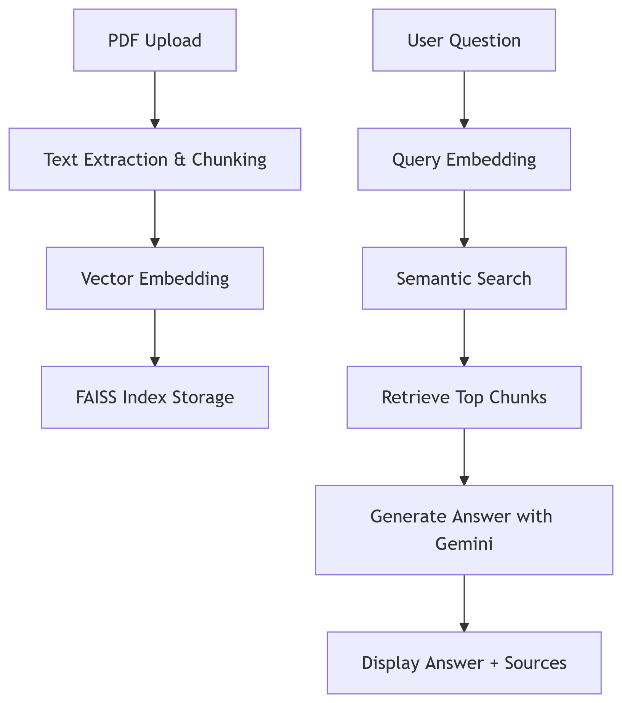

# PDF Chat Assistant with Gemini Flash 1.5

[👉 Watch Full Demo](https://drive.google.com/file/d/1a24rUBTMB9E5yNPMtDnFbpcaaauazoSL/view?usp=sharing)

### 🏗️ System Architecture



## 📌 Features
- **Multi-PDF Processing** - Analyze multiple documents simultaneously
- **Smart Q&A** - Get accurate answers powered by Gemini Flash 1.5
- **Document Understanding** - Deep semantic comprehension of your files
- **Source Tracking** - Always see which document provided the answer

## 🛠️ Technology Stack
| Component           | Technology Used      | Purpose                     |
|---------------------|----------------------|-----------------------------|
| pdfplumber          | Text Extraction      | Extract text from PDFs       |
| Sentence-Transformers | all-MiniLM-L6-v2    | Generate text embeddings     |
| FAISS               | Vector Search        | Fast similarity search       |
| Gemini Flash 1.5    | Answer Generation    | Generate contextual answers  |
| Streamlit           | Web Interface        | User-friendly UI            |

## 🚀 Getting Started

### Prerequisites
- Python 3.8+
- [Gemini API key](https://ai.google.dev/)

### Installation
```bash
git clone https://github.com/somyajangir/Chat-with-Multiple-PDFs-using-RAG-and-Gemini-Flash.git
cd pdf-qa-assistant
pip install -r requirements.txt
cp .env.example .env  # Add your Gemini API key here
streamlit run app.py
